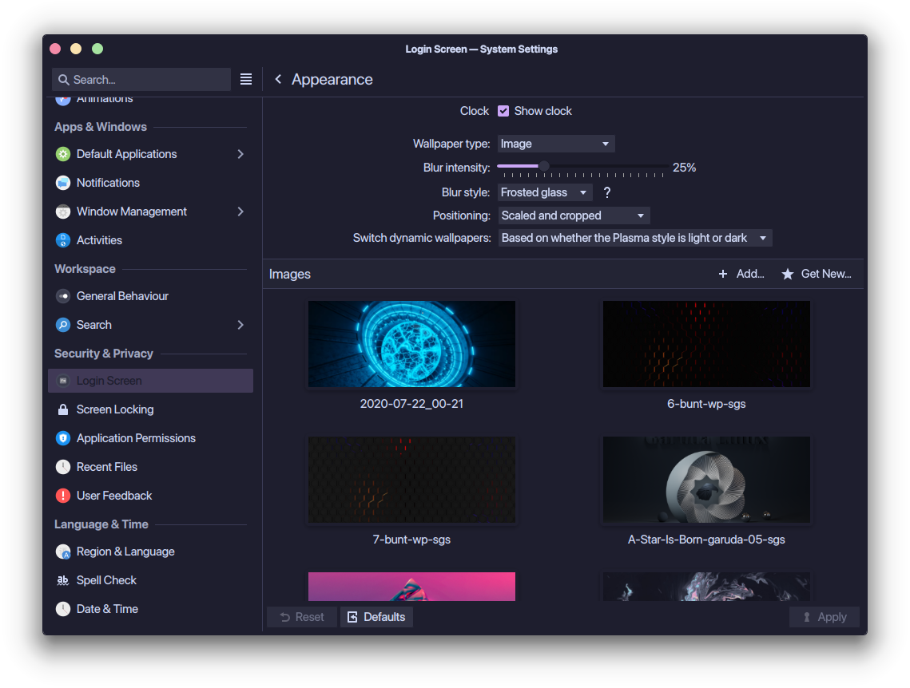
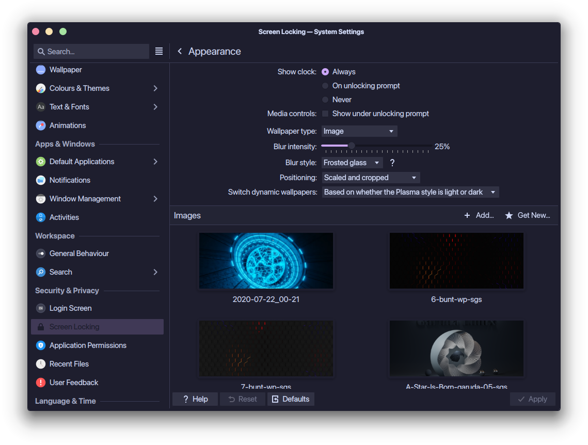

# plasma-login-blur-slider

Adds a **Blur intensity** slider and a **Blur style** choice to *System
Settings → Login Screen → Configure Appearance…* and to *System Settings →
Screen Locking → Configure Appearance…*, so you can choose how Plasma blurs
the wallpaper behind the login prompt and behind the unlock prompt:

* **Standard** is the screen's own blur, from 0 % (no blur) to 100 % (the
  stock look).
* **Frosted glass** is a smooth Gaussian blur, the kind a desktop
  compositor's blur effect produces. It shows gradually more of the wallpaper
  as you lower the intensity and goes much further at the top of the scale.

The login screen and the lock screen each have their own settings, next to
their own wallpaper. On both, the blur is applied while the password prompt
is showing and fades out when only the clock is left, as Plasma designed it;
the settings decide what it looks like.

Plasma Login Manager and the lock screen are not patched, replaced or
rebuilt, and nothing is compiled, so the package keeps working across Plasma
updates.

If a third-party compositor effect such as Better Blur DX is blurring the
whole login screen, the package also switches that off, for the login screen
only (see "Compositor blur effects" below).

## Install

### Garuda, CachyOS, EndeavourOS, Manjaro, Arch

Download `plasma-login-blur-slider-<version>-1-any.pkg.tar.zst` from the
[latest release](../../releases/latest) and install it:

    sudo pacman -U plasma-login-blur-slider-*-any.pkg.tar.zst

or build it yourself, in a clone or in an unpacked release tarball:

    makepkg -si

That is all. A pacman hook keeps things in step whenever Plasma's wallpaper
plugins are updated.

### Other distributions

    sudo make install install-systemd-unit
    sudo systemctl enable --now plasma-login-blur-slider.service

The service runs `plasma-login-blur-slider sync` now and at every boot, which
is what the pacman hook does on Arch-based systems.

## Use

Open *System Settings → Login Screen → Configure Appearance…*, pick a **Blur
style**, move the **Blur intensity** slider and press *Apply*. The change
shows the next time the login screen starts (log out or reboot).

The same from a terminal:

    plasma-login-blur-slider get              # intensity, prints 0-100
    sudo plasma-login-blur-slider set 35
    plasma-login-blur-slider style            # prints standard or frosted
    sudo plasma-login-blur-slider style frosted
    plasma-login-blur-slider status           # what is installed, current settings

The lock screen is set up the same way in *System Settings → Screen Locking →
Configure Appearance…*, and shows the change the next time the screen is
locked. Its settings belong to your user, so from a terminal they are changed
without `sudo`, by adding `--lock`:

    plasma-login-blur-slider get --lock
    plasma-login-blur-slider set 35 --lock
    plasma-login-blur-slider style frosted --lock

Each time the login screen starts, its wallpaper process logs one line such
as `plasma-login-blur-slider: login wallpaper blur set to 35% (frosted
glass)`, and so does the lock screen each time it comes up (`lock screen
wallpaper blur set to …`). That is a quick way to confirm the settings were
picked up:

    journalctl -b | grep plasma-login-blur-slider

### The two styles

The intensity means something different in each style, because frosted glass
reaches much further:

| | Standard | Frosted glass |
|---|---|---|
| What it is | the login screen's own blur, scaled down | a Gaussian blur laid over the wallpaper |
| 100 % | the stock look | as strong as KWin's blur effect (also Better Blur DX) at strength 12 of 15 |
| Same strength as the stock look | 100 % | about 25 % |
| Lower values | the stock effect at a smaller radius | the same smooth blur, proportionally narrower |

In numbers: frosted glass is a Gaussian blur with a standard deviation of
0.64 pixels per percent, 64 pixels at 100 %. The stock blur comes to about
14.5 pixels, and KWin's blur effect to about 62 at strength 12 and 90 at its
maximum.

Standard at 100 % is the default, and with it the login screen looks exactly
as it does without this package.

## Compositor blur effects (Better Blur DX and the like)

The login screen runs its own compositor (KWin) with its own settings, kept
in the home directory of the `plasmalogin` user. When desktop settings have
been copied there at some point, a "blur every window" effect such as Better
Blur DX can be enabled for the login screen as well. It then blurs the whole
login wallpaper, all the time, and neither the login screen nor this slider
has any say over it.

So that the slider is the only thing that decides, the package switches such
effects off for the login screen. Your desktop keeps them. This happens

* when the package is installed or updated and whenever `sync` runs, and
* each time the login screen starts, just before its compositor does, so a
  settings file that is copied over again later is put right as well.

What counts: every compositor effect with "blur" in its id (`better_blur_dx`,
`forceblur`, …) except KWin's own `blur`, which only blurs where a window
asks for it and does not affect the wallpaper. `plasma-login-blur-slider
status`, run as root, shows what was switched off, and uninstalling the
package (or `remove`) switches exactly those back on.

To leave the login screen's compositor alone, put this into
`/etc/plasma-login-blur-slider.conf`:

    LOGIN_COMPOSITOR_BLUR=keep

To have further effects switched off for the login screen, list their ids:

    LOGIN_COMPOSITOR_EFFECTS="diminactive"

## Remove

    sudo pacman -R plasma-login-blur-slider

(or `sudo make uninstall`). This restores the stock behaviour completely,
including compositor effects the package had switched off. Leftover
`LoginBlurIntensity=` and `LoginBlurStyle=` lines in `/etc/plasmalogin.conf`
are ignored by Plasma and disappear the next time you press *Apply* in the
Login Screen settings.

If wallpapers ever misbehave and you suspect this package, this brings the
stock wallpaper plugins back immediately, without uninstalling anything:

    sudo plasma-login-blur-slider remove

(`sudo plasma-login-blur-slider sync` turns it back on.)

## If it does not work

    sudo plasma-login-blur-slider debug on

then restart, and at the login screen wait ten seconds, move the mouse so the
password prompt appears, and leave everything alone for twenty seconds until
the prompt is gone again. Log in and run

    sudo plasma-login-blur-slider report

This writes a folder `plasma-login-blur-report` to your home directory. It
contains `report.txt` (versions, the login screen's configuration, what the
login wallpaper process and the compositor logged) and a few screenshots the
wallpaper process took of its own output. Together they show whether the blur
you see is the one this add-on controls or comes from somewhere else, for
example a compositor effect. `sudo plasma-login-blur-slider debug off`
switches the diagnostics off again.

## How it works

The login screen and the lock screen draw their wallpaper with an ordinary
Plasma wallpaper plugin (the same *Image*, *Plain Color*, … plugins the
desktop uses), and their settings pages embed that plugin's own settings
page. Plugins are looked up in `/usr/local/share` before `/usr/share`.

`plasma-login-blur-slider sync` puts a small *overlay* plugin with the same
id into `/usr/local/share/plasma/wallpapers/<id>/`. The overlay contains no
copy of the stock plugin's code. Its `main.qml` and `config.qml` load the
stock files and add three things:

* the settings `LoginBlurIntensity` and `LoginBlurStyle`, saved by the Login
  Screen and Screen Locking settings exactly like the wallpaper's other
  settings (in `/etc/plasmalogin.conf` for the login screen, in your
  `~/.config/kscreenlockerrc` for the lock screen);
* the slider and the style choice, which are only created inside those two
  settings pages;
* a hook that scales the screen's blur by the intensity. It only acts inside
  Plasma Login Manager's wallpaper process and inside the lock screen. Both
  build the same scene around the wallpaper.

For frosted glass the hook also lays a Gaussian blur of the wallpaper over
the login screen's own blur, inside the picture the login screen then applies
its colour adjustment to, and fades it in and out with the prompt. The login
screen's own blur only carries the transition then. The Gaussian blur is
computed on a reduced copy of the wallpaper and scaled back up, which makes
even the widest setting cheap, and only when the wallpaper changes. What it
blurs is the picture as it is on screen without blur, including the window's
background where a wallpaper is transparent, so nothing sharp is left showing
through (the standard blur, like the stock one, does leave the edges of
transparent areas visible).

The desktop finds the same overlay plugins, but for it they behave exactly
like the stock plugins.

What the package creates outside its own files is in
`/usr/local/share/plasma/wallpapers/`, one directory per wallpaper type, each
marked with a `.plasma-login-blur-slider` file. Directories there that it did
not create are never touched.

The one other thing it changes is the login user's `kwinrc`, and only if a
compositor blur effect is enabled there: it sets that effect's
`<id>Enabled` entry to `false` and notes the id in a
`[plasma-login-blur-slider]` group in the same file, which is how `remove`
knows what to switch back on.

## Good to know

* **Only the blur changes.** Both screens also adjust the wallpaper's colours
  a little so the text stays readable; that stays as it is, in both styles
  and even at 0 %.
* **The blur follows the prompt.** With only the clock on screen the
  wallpaper is not blurred at any setting. The login screen usually starts
  with the prompt showing, for about ten seconds if nothing is touched, so it
  usually starts out blurred.
* **Two screens, two sets of settings.** The login screen's are system-wide
  and need the administrator password; the lock screen's are per user. One
  does not follow the other: set both if you want them to match.
* Both settings are stored with the settings of the chosen wallpaper type.
  When you switch the type in the settings, the slider and the style keep
  what they were set to.
* Frosted glass measures in pixels, like the stock blur and like a
  compositor's, so the same setting looks stronger on a screen with fewer of
  them. On a scaled (HiDPI) screen these are the scaled pixels: the blur
  looks the same as on an unscaled screen of the same effective resolution.
* The slider moves in steps of 5 %; `set` accepts any whole number from 0 to
  100.
* Wallpaper types are overlaid if they are installed system-wide and are
  one of those Plasma Login Manager offers, or Slideshow, which the lock
  screen also offers: `org.kde.image`, `org.kde.slideshow`, `org.kde.color`,
  `org.kde.potd`, `org.kde.haenau`, `org.kde.hunyango`, `org.kde.tiled`,
  `online.knowmad.shaderwallpaper`. The lock screen accepts any installed
  wallpaper type; for one that is not in this list, add it to `PLUGINS="…"`
  in `/etc/plasma-login-blur-slider.conf` (or set `PLUGINS=all`) and run
  `sudo plasma-login-blur-slider sync`.
* `/usr/local/share` has to come before `/usr/share` in `XDG_DATA_DIRS`,
  which is the default. `plasma-login-blur-slider status` checks this for the
  session it is run in.
* Switching the wallpaper type in the settings logs a few harmless warnings
  from Kirigami's FormLayout while the old rows are removed.
* A look-and-feel theme that brings its own lock screen is only covered if
  that lock screen blurs the wallpaper the way Plasma's does.
* The hook relies on how the two screens build their wallpaper scene, and
  the controls on how their settings pages are laid out. If a future release
  changes either, the affected part quietly does nothing and you are back to
  stock behaviour; the screens themselves are not affected.

## Tested with

Plasma Login Manager 6.7.5 and the lock screen of Plasma 6.7.5 from the Arch
Linux packages (KDE Frameworks 6.30, Qt 6.11), with the Image, Plain Color,
Picture of the Day, Haenau, Hunyango and Tiled wallpaper types and both blur
styles, including the desktop, which has to keep behaving as before. The lock
screen was run in its test mode, also with the Slideshow type.

The wallpaper process and the settings module of Plasma Login Manager 6.6.6,
of the 6.8 beta and of the development branch (October 2026) were also run
against it, built from source on the same system.

The frosted glass blur was compared with an exact Gaussian blur of the same
picture at 3840×1600, from 5 % to 100 %, and on a scaled screen. All of this
was done with software rendering; it has not been measured on real graphics
hardware.

The compositor part was tested with systemd 262 and a settings file taken
from a Garuda system that had Better Blur DX enabled for its login screen.

## Files

    /usr/bin/plasma-login-blur-slider             the sync/remove/get/set/style/debug/report tool
    /usr/share/plasma-login-blur-slider/          QML the overlays are made from
    /usr/lib/systemd/user/plasma-login-kwin_wayland.service.d/50-plasma-login-blur-slider.conf
                                                  runs the compositor check before the login
                                                  screen's compositor starts
    /usr/share/libalpm/hooks/plasma-login-blur-slider.hook    (Arch-based)
    /usr/lib/systemd/system/plasma-login-blur-slider.service  (other distros)
    /etc/plasma-login-blur-slider.conf            optional overrides

## Development

See [CONTRIBUTING.md](CONTRIBUTING.md).

## License

GPL-3.0-or-later; the text is in [LICENSE](LICENSE).
